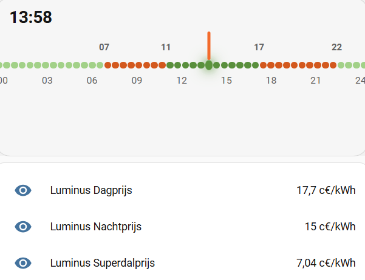

# Home Assistant Boiler Controller

Dit project bevat een autonome boilercontroller voor een Shelly Pro 1 Gen2, aangestuurd via MQTT door Home Assistant.

De kernregel is:

```text
Home Assistant bepaalt WANNEER verwarmen zinvol is.
Shelly beslist OF verwarmen veilig kan en schakelt het relais.
```

Home Assistant levert configuratie, planning en energiemetingen. De Shelly blijft de controller voor runtime, restart delay, watchdog, persistentie, piekbeveiliging en relaissturing.

## Structuur

```text
build/              Buildoutput en buildscript
build/build.ps1     Concateneert Shelly-bronbestanden in vaste volgorde
docs/               Architectuur, protocol en werkdocumentatie
homeassistant/      Home Assistant packages
shelly/src/         Genummerde Shelly JavaScript-bronbestanden
test/               Test- en protocolvoorbeelden
```

## Belangrijke regels

- Geen npm, bundler, imports, modules of TypeScript.
- Shelly krijgt uiteindelijk een enkel JavaScript-bestand.
- Tijdens ontwikkeling staat de Shelly-code opgesplitst in `shelly/src/`.
- `build/build.ps1` gebruikt een expliciete bestandslijst.
- Home Assistant schakelt het relais nooit rechtstreeks.
- Veiligheid gaat altijd boven comfort en kostenoptimalisatie.

## Redenen achter deze automatisering

Door het afsluiten van een nieuw contract bij onze energieleverancier beschikken we over een periode met een superdaltarief. Tijdens die periode kost elektriciteit minder dan de helft van het normale nachttarief.



Dat maakt dit het ideale moment om de boiler te verwarmen. Tegelijk moet vermeden worden dat de kwartierpiek te hoog wordt wanneer er ook andere verbruikers actief zijn. Home Assistant berekent daarom continu een voorspelling van het kwartierverbruik. De Shelly gebruikt die informatie lokaal om de boiler tijdelijk uit te schakelen wanneer de ingestelde pieklimiet dreigt overschreden te worden.
