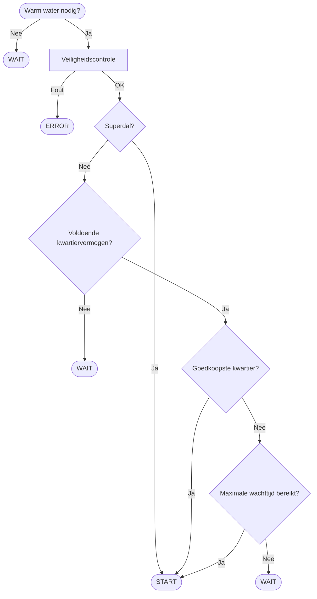

# Decision Engine

## Doel

De Decision Engine bepaalt **wanneer** de boiler mag starten.

Ze evalueert voortdurend de beschikbare informatie en beslist of het huidige kwartier het optimale moment is om de boiler in te schakelen.

De State Machine roept de Decision Engine aan wanneer de boiler zich in de toestand **WAIT_FOR_SLOT** bevindt.

---

# Beslissingsvolgorde


## Beslissingsflow




Iedere evaluatie verloopt in exact dezelfde volgorde.

```text
Warm water nodig?
        │
        ▼
Mag de boiler überhaupt starten?
        │
        ▼
Is dit een superdalperiode?
        │
        ▼
Is er nog kwartiervermogen beschikbaar?
        │
        ▼
Is dit het goedkoopste kwartier?
        │
        ▼
START
```

Wanneer één stap negatief wordt beoordeeld, stopt de evaluatie onmiddellijk.

---

# Stap 1 – Warm water nodig?

## Doel

Voorkomen dat de boiler onnodig wordt ingeschakeld.

## Controle

- Boiler heeft opnieuw verwarming nodig.
- Geen actieve verwarmingscyclus.
- Minimale rusttijd verstreken.

## Resultaat

| Voorwaarde | Actie |
|------------|-------|
| Warm water nodig | Verder naar stap 2 |
| Geen warm water nodig | WAIT |

---

# Stap 2 – Veiligheidscontrole

## Doel

Voorkomen dat de boiler onder onveilige omstandigheden wordt ingeschakeld.

## Controle

- Shelly bereikbaar.
- Home Assistant actief.
- Watchdog OK.
- Geen actieve foutstatus.
- Maximum aantal starts niet overschreden.

## Resultaat

| Voorwaarde | Actie |
|------------|-------|
| Alles OK | Verder naar stap 3 |
| Fout gedetecteerd | ERROR |

---

# Stap 3 – Superdalcontrole

## Doel

Maximaal gebruikmaken van de goedkoopste tariefperiode.

## Controle

Valt de huidige tijd binnen de ingestelde superdalperiode?

## Resultaat

| Voorwaarde | Actie |
|------------|-------|
| Ja | START |
| Nee | Verder naar stap 4 |

---

# Stap 4 – Controle van het kwartiervermogen

## Doel

Voorkomen dat de ingestelde maandpiek wordt overschreden.

## Berekening

```
Beschikbaar vermogen =
Maximaal toegelaten kwartiervermogen
−
Huidig kwartiervermogen
```

## Controle

Is het beschikbare vermogen voldoende om de boiler veilig te starten?

## Resultaat

| Voorwaarde | Actie |
|------------|-------|
| Voldoende vermogen | Verder naar stap 5 |
| Onvoldoende vermogen | WAIT |

---

# Stap 5 – Prijscontrole

## Doel

De boiler laten starten tijdens het goedkoopste beschikbare kwartier.

## Controle

Vergelijk:

- huidige kwartierprijs;
- volgende kwartierprijzen;
- ingestelde prijsdrempels;
- maximale toegelaten wachttijd.

## Resultaat

| Voorwaarde | Actie |
|------------|-------|
| Huidig kwartier is gunstig | START |
| Goedkoper kwartier verwacht | WAIT |

---

# Stap 6 – Comfortcontrole

## Doel

Voorkomen dat de gebruiker zonder warm water komt te zitten.

Wanneer de maximale wachttijd bijna bereikt wordt, krijgt comfort voorrang op de elektriciteitsprijs.

## Resultaat

| Voorwaarde | Actie |
|------------|-------|
| Maximale wachttijd bereikt | START |
| Nog voldoende wachttijd | WAIT |

---

# Prioriteiten

Wanneer meerdere regels gelijktijdig van toepassing zijn, geldt steeds onderstaande prioriteitsvolgorde.

| Prioriteit | Omschrijving |
|------------|--------------|
| 1 | Veiligheid |
| 2 | Comfort |
| 3 | Beperken van de maandpiek |
| 4 | Elektriciteitsprijs minimaliseren |
| 5 | Zo weinig mogelijk starts |

---

# Gebruikte parameters

Alle instelbare waarden worden gelezen uit `boiler_parameters.yaml`.

Voorbeelden:

- maximum kwartiervermogen;
- superdal begin- en einduur;
- minimale rusttijd;
- maximale wachttijd;
- maximale verwarmingsduur;
- prijsdrempels;
- veiligheidsmarges.

De Decision Engine bevat geen vaste ("hardcoded") waarden.

---

# Mogelijke resultaten

Na iedere evaluatie geeft de Decision Engine exact één resultaat terug.

| Resultaat | Betekenis |
|-----------|-----------|
| START | Boiler onmiddellijk inschakelen |
| WAIT | Nog niet starten |
| CANCEL | Verwarming niet langer nodig |
| ERROR | Fouttoestand |

---

# Ontwerpprincipes

De Decision Engine voldoet aan de volgende uitgangspunten:

- Deterministisch: dezelfde invoer geeft altijd dezelfde beslissing.
- Geen hardcoded parameters.
- Veiligheid heeft altijd de hoogste prioriteit.
- Comfort primeert op kostprijs wanneer nodig.
- De maandpiek wordt actief bewaakt.
- Elektriciteitskosten worden geoptimaliseerd zonder het comfort in gevaar te brengen.

---

# Toekomstige uitbreidingen

De architectuur laat uitbreiding toe zonder de bestaande logica fundamenteel te wijzigen.

Mogelijke uitbreidingen:

- Gebruik van PV-overschot.
- Negatieve elektriciteitsprijzen.
- Dynamische vermogensregeling.
- Legionella-programma.
- Vakantiemodus.
- AI-voorspelling van warmwaterverbruik.
- Integratie met een thuisbatterij.